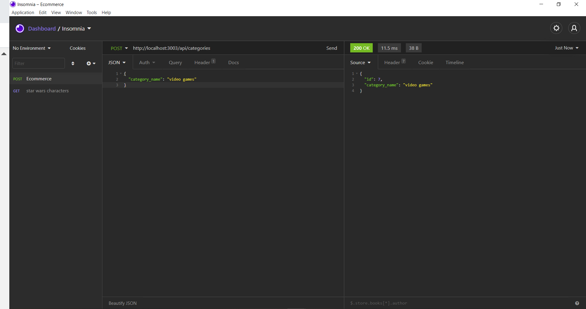
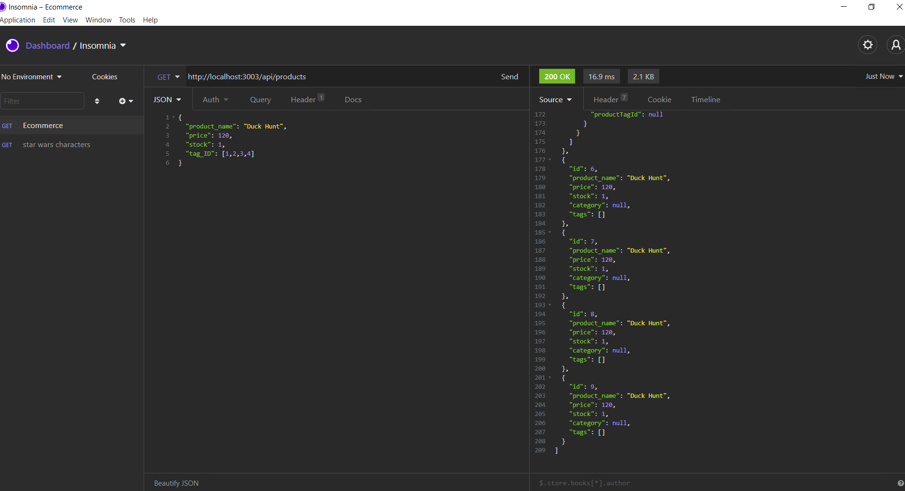

# E-commerce
* A backend app that uses seeding through using MySQL.

## Overview

* uses MySQL, node, express, and env for functionality
* Insomnia is the prefured app to use application

### Help

* used the videos suplied to us trough zoom for review
* used insomnia doc's to help with operating the app
* was rusty with seeding and npm doc's helped with the seeding of the database

# Screenshots

## Video Demo

[Video Demo](https://drive.google.com/file/d/1P2-alqzqcxNsuRf3-QsV4FWAJKB1UZe6/view)