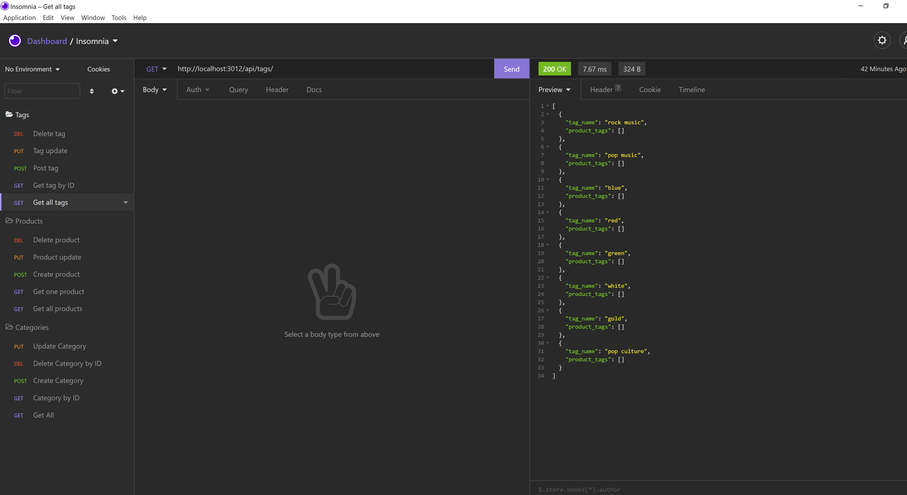

# E-commerce
* A backend app that uses seeding through using MySQL.

## Overview

* uses MySQL, node, express, and env for functionality
* Insomnia is the prefured app to use application

### Help

* used the videos suplied to us trough zoom for review
* used insomnia doc's to help with operating the app
* was rusty with seeding and npm doc's helped with the seeding of the database

#### How to use
fork repo and run npm install
open in insomnia

##### Tech
JS
insomnia
node

# Screenshots

## Video Demo

[Video Demo](https://drive.google.com/file/d/1avIkrfA_z_ehqVnP-_aiYIVgqGSkU5_c/view)
